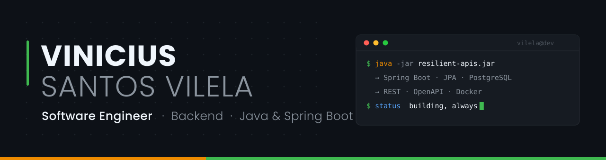

<div align="center">
  
</div>

<div align="center">
  <a href="https://github.com/Vinicius-S-Vilela">
    
  </a>
</div>

<div align="center">
  
  <a href="https://github.com/Vinicius-S-Vilela?tab=followers">
    
  </a>
  <a href="https://github.com/Vinicius-S-Vilela?tab=repositories">
    
  </a>
  <a href="https://www.linkedin.com/in/vinicius-s-vilela">
    
  </a>
</div>

<br>

## 👨‍💻 About Me

I'm a **Computer Science student at USCS** and a software developer focused on **backend engineering in the Java ecosystem**. What drives me is the part of the job that doesn't fit in a tutorial: designing system architecture, modeling databases that stay correct under load, and turning a messy requirement into a clean, resilient API.

Professionally I work with complex enterprise integrations inside the Microsoft ecosystem — **Power Platform, Microsoft Graph API and Azure AI** — where a good part of the work is engineering around native platform limits with pro-code. This GitHub is the other half: the lab where I build the systems I actually want to design, end to end.

```java
public class Vinicius extends SoftwareEngineer {

    private static final String FOCUS = "Backend Architecture & Data Modeling";

    @Override
    public Stack currentStack() {
        return Stack.builder()
                .language("Java 21")
                .framework("Spring Boot")
                .persistence("PostgreSQL", "JPA/Hibernate")
                .frontend("Angular", "TypeScript")
                .infra("Docker", "REST", "OpenAPI")
                .build();
    }

    @Override
    public List<String> currentlyLearning() {
        return List.of("System Design", "Microservices", "Cloud Architecture");
    }

    @Override
    public String offScreen() {
        return "Raising a pack of Fox Paulistinhas 🐕 + indoor cycling miles";
    }
}
```

<br>

## 🛠️ Tech Stack

<table>
  <tr>
    <td valign="top" width="50%">

<b>Core — Backend</b>
<br><br>


  </td>
    <td valign="top" width="50%">

<b>Data</b>
<br><br>


  </td>
  </tr>
  <tr>
    <td valign="top">

<b>Frontend</b>
<br><br>


  </td>
    <td valign="top">

<b>DevOps & Tooling</b>
<br><br>


  </td>
  </tr>
  <tr>
    <td valign="top">

<b>AI & Python</b>
<br><br>


  </td>
    <td valign="top">

<b>Microsoft Ecosystem</b>
<br><br>


  </td>
  </tr>
</table>

<br>

## 🚀 Featured Projects

<table>
  <tr>
    <td valign="top" width="50%">

<h3 align="center">🐕 CãoRadar</h3>
<p align="center"><i>Computer vision + multimodal AI to find lost dogs in the city</i></p>
<p align="center">
  <a href="https://github.com/Vinicius-S-Vilela/caoradar-platform"></a>
  <a href="https://github.com/Vinicius-S-Vilela/caoradar-platform/forks"></a>
  
</p>
<p align="center">
  
  
  
  
  
  
</p>
<p align="center">
  <a href="https://github.com/Vinicius-S-Vilela/caoradar-platform"></a>
</p>

  </td>
    <td valign="top" width="50%">

<h3 align="center">🛡️ Sentinela</h3>
<p align="center"><i>Multi-tenant price monitoring SaaS with Telegram alerts</i></p>
<p align="center">
  <a href="https://github.com/Vinicius-S-Vilela/sentinela-precos"></a>
  <a href="https://github.com/Vinicius-S-Vilela/sentinela-precos/forks"></a>
  
</p>
<p align="center">
  
  
  
  
  
  
</p>
<p align="center">
  <a href="https://github.com/Vinicius-S-Vilela/sentinela-precos"></a>
</p>

  </td>
  </tr>
</table>

<details open>
<summary><b>🐕 CãoRadar — the architecture in detail</b></summary>
<br>

> Capstone project (USCS). A SaaS platform that reads urban camera feeds, detects dogs with computer vision, classifies their traits with multimodal AI, and matches them against open missing-dog reports with a 0–100% biometric score.

| Layer | Stack |
| :--- | :--- |
| **Backend** | Java 21 · Spring Boot 4 · Maven · REST |
| **AI Service** | Python 3.11 · FastAPI · YOLOv8s (detection) · Gemini 2.5 (classification & matching) |
| **Frontend** | Angular 17 · TypeScript · Leaflet |
| **Data** | PostgreSQL 15 (NeonDB) · hybrid relational + JSONB modeling |
| **Infra** | Render · Vercel · Cloudinary · HuggingFace Spaces |

**What made it interesting:** orchestrating three runtimes (JVM, Python, browser) behind one contract, and designing the matching pipeline so an AI score stays auditable instead of being a black box.

</details>

<details>
<summary><b>🛡️ Sentinela — the architecture in detail</b></summary>
<br>

> A full-stack SaaS that tracks e-commerce prices and pings users on Telegram when a target is hit. Discontinued as a product, open-sourced as a study case — the architecture is the point.

| Layer | Stack |
| :--- | :--- |
| **Backend** | Java 17 · Spring Boot 3 · Spring Security · JWT · JPA/Hibernate |
| **Frontend** | Angular 17 · TypeScript · PrimeNG · HTTP Interceptors |
| **Data** | PostgreSQL · strict per-tenant isolation |
| **Integrations** | Telegram Bot API · scheduled scraping routines |
| **DevOps** | Docker · Docker Compose |

**What made it interesting:** multi-tenant data isolation done at the persistence layer rather than trusted to the UI, and scrapers built with fallback states so one blocked target never takes the scheduler down.

</details>

<details>
<summary><b>📚 More from the lab</b></summary>
<br>

| Project | What it is | Stack |
| :--- | :--- | :--- |
| [**gerenciador-eventos**](https://github.com/Vinicius-S-Vilela/gerenciador-eventos) | Event management system for USCS internal events — registrations, speakers, attendance and certificates | `Java` `OOP` `Inheritance` |
| [**space-launch-analysis**](https://github.com/Vinicius-S-Vilela/space-launch-analysis) | Exploratory analysis of global rocket launches: costs, success rates and the most active countries | `Python` `Pandas` |
| [**binary-search-tree**](https://github.com/Vinicius-S-Vilela/binary-search-tree) | BST implemented from scratch — insertion, traversal and search | `Java` `Data Structures` |
| [**conta-banco**](https://github.com/Vinicius-S-Vilela/conta-banco) | Bank account simulator: the OOP fundamentals, done properly | `Java` `OOP` |

</details>

<br>

## 📊 GitHub Analytics

<div align="center">
  
  
</div>

<div align="center">
  
</div>

<br>

## 🐍 Contribution Graph

<div align="center">
  
</div>

<br>

## 🤝 Let's Connect

<div align="center">
  <a href="https://www.linkedin.com/in/vinicius-s-vilela" target="_blank">
    
  </a>
  <a href="mailto:viniciussantosvilela.v2@gmail.com">
    
  </a>
  <a href="https://github.com/Vinicius-S-Vilela">
    
  </a>
</div>

<br>

<div align="center">
  <i>Open to backend engineering opportunities — Java, Spring Boot and everything that has to stay up at 3 a.m.</i>
  <br><br>
  
</div>

<!--
  🏆 TROPHIES — desativado de propósito.
  O serviço github-profile-trophy.vercel.app está retornando HTTP 402 (limite da
  conta Vercel do projeto), então o card aparecia quebrado no perfil.
  Se o serviço voltar, é só apagar estes comentários e a seção volta ao ar.

## 🏆 Trophies

<div align="center">
  <a href="https://github.com/Vinicius-S-Vilela">
    
  </a>
</div>
-->
